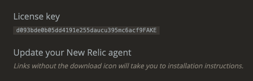

## Requirements

)
)

## Branchについて

リポジトリに3つのブランチがあります。

- master
    - なにもチューニングをしていない環境が作れます。
- improve
    - チューニングした環境がつくれます。
- scale_out
    - webサーバーを2台、RDSをスケールアップした環境がつくれます。

## Preparation

### Terraform用変数

`terraform/terraform.tfvars` ファイルを作成して以下を埋めつつ追記してください。

```
domain=
#acm_domain=
db_name=
db_user=
db_pass=
```

domainはなくても可能ですが、`domain.tf` ファイルを調整してください。

acm_domainはあらかじめ東京リージョンで証明書を作成したドメインを入力してください。httpsを使用しない場合は不要で `https.tf` ファイルも削除かコメントアウトしてください。

### Ansible用変数

`ansible/roles/app/files/.env` を作成して以下を埋めつつ追記してください。

```
APP_NAME=
APP_ENV=dev
APP_KEY= #ここは埋めなくてOK
APP_DEBUG=false
APP_URL=

LOG_CHANNEL=stack

DB_CONNECTION=pgsql
DB_HOST=
DB_PORT=5432
DB_DATABASE=
DB_USERNAME=
DB_PASSWORD=

SESSION_DRIVER=redis
SESSION_LIFETIME=120

REDIS_HOST=
REDIS_PASSWORD=null
REDIS_PORT=6379
```

laravelで使う `.env` で、AnsibleでローカルからWebサーバーにコピーします。

### New Relic

プロファイリングツールにNew Relicを使用します。あらかじめアカウントを作成しておいてください。(1Userまでは無料のようです。)

[New Relic](https://newrelic.com/jp)

Account Settingsページの右にLicense keyがありますのでそれをあとから使います。



### AMIを作成する

EC2インスタンスはAMIから作成するのであらかじめ作成しておきます。

`packer/` ディレクトリに移動しておきます。

webサーバーのAMIを作成します。New RelicのLicense keyを変数として渡しながらpackerコマンドを実行します。

```
packer build -var 'newrelic_key=foo' web.json
```

攻撃サーバーのAMIを作成します。

```
packer build attack_server.json
```

### Terraformで環境をセットアップする

`terraform/` ディレクトリに移動しておきます。

```
terraform plan
```

実行計画がよければapplyします。

```
terraform apply
```

### Seeding

DBにダミーデータを作成します。

Session Managerからテスト対象サーバーにログインします。(load-test-web)

データ量があるので少し時間がかかります。

```
cd /var/www/laravel
php artisan migrate --seed
```

## SSHについて

サーバーにログインするためにSSH接続でなくSession Managerを使用しています。

